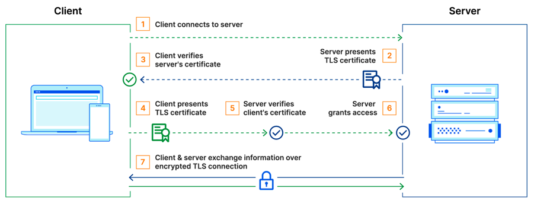
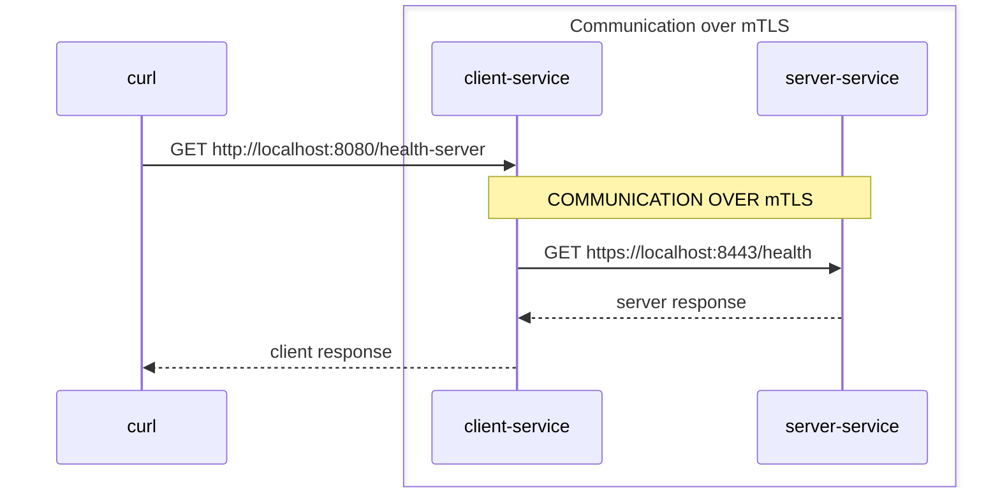

# mTLS between client-service and server-service using java.net.http.HttpClient

# What is mTLS 


# Setup
We have 2 services `client-service` and `server-service`
* `server-service` has one REST endpoint `/health` that always returns true for simplicity

* `client-service` has one REST endpoint `/health-server` that calls `/health` from `server-service`

* `client-service` integrates to `server-service` using `java.net.http.HttpClient`



# Creating the certificates

Generate the key pairs for the client and server
```
keytool -genkeypair -alias server -keyalg RSA -keysize 4096 -validity 365 -dname "CN=Server,OU=Server,O=Examples,L=,S=CA,C=U" -keypass changeit -keystore server.p12 -storeType PKCS12 -storepass changeit
keytool -genkeypair -alias client -keyalg RSA -keysize 4096 -validity 365 -dname "CN=Client,OU=Server,O=Examples,L=,S=CA,C=U" -keypass changeit -keystore client.p12 -storeType PKCS12 -storepass changeit
```
Export the public keys
```
keytool -exportcert -alias client -file client.cer -keystore client.p12 -storepass changeit
keytool -exportcert -alias server -file server.cer -keystore server.p12 -storepass changeit
```
Import public keys to trust stores
```
keytool -importcert -keystore client-truststore.p12 -alias server-public -file server.cer -storepass changeit -noprompt
keytool -importcert -keystore server-truststore.p12 -alias client-public -file client.cer -storepass changeit -noprompt
```

# Startup

Use maven to build both services
```
mvn clean install
```

Use maven to start both services
```
mvn spring-boot:run
```

# Using the API to test mTLS
### Calling `client-service` for the server health using the integration and HttpClient

Request:
```
curl -v http://localhost:8080/health-server
```

Response:
```
*   Trying 127.0.0.1:8080...
* Connected to localhost (127.0.0.1) port 8080 (#0)
> GET /health-server HTTP/1.1
> Host: localhost:8080
> User-Agent: curl/8.1.2
> Accept: */*
>
< HTTP/1.1 200
< X-Content-Type-Options: nosniff
< X-XSS-Protection: 0
< Cache-Control: no-cache, no-store, max-age=0, must-revalidate
< Pragma: no-cache
< Expires: 0
< X-Frame-Options: DENY
< Content-Type: application/json
< Transfer-Encoding: chunked
< Date: Tue, 05 Sep 2023 15:17:31 GMT
<
* Connection #0 to host localhost left intact
true%
```

### Calling `server-service` directly providing the client certificate 

Request:
```
curl -k -v --cert-type P12 --cert client.p12:changeit https://localhost:8443/health
```

Response:
``` 
*   Trying 127.0.0.1:8443...
* Connected to localhost (127.0.0.1) port 8443 (#0)
* ALPN: offers h2,http/1.1
* (304) (OUT), TLS handshake, Client hello (1):
* (304) (IN), TLS handshake, Server hello (2):
* (304) (IN), TLS handshake, Unknown (8):
* (304) (IN), TLS handshake, Request CERT (13):
* (304) (IN), TLS handshake, Certificate (11):
* (304) (IN), TLS handshake, CERT verify (15):
* (304) (IN), TLS handshake, Finished (20):
* (304) (OUT), TLS handshake, Certificate (11):
* (304) (OUT), TLS handshake, CERT verify (15):
* (304) (OUT), TLS handshake, Finished (20):
* SSL connection using TLSv1.3 / AEAD-CHACHA20-POLY1305-SHA256
* ALPN: server did not agree on a protocol. Uses default.
* Server certificate:
*  subject: C=U; ST=CA; L=; O=Examples; OU=Server; CN=Server
*  start date: Sep  5 09:17:35 2023 GMT
*  expire date: Sep  4 09:17:35 2024 GMT
*  issuer: C=U; ST=CA; L=; O=Examples; OU=Server; CN=Server
*  SSL certificate verify result: self signed certificate (18), continuing anyway.
* using HTTP/1.x
> GET /health HTTP/1.1
> Host: localhost:8443
> User-Agent: curl/8.1.2
> Accept: */*
>
< HTTP/1.1 200
< Content-Type: application/json
< Transfer-Encoding: chunked
< Date: Tue, 05 Sep 2023 15:24:07 GMT
<
* Connection #0 to host localhost left intact
true%
```

### Calling `server-service` without providing the client certificate 
Request:
``` 
curl -k -v https://localhost:8443/health
```
Response:
```
*   Trying 127.0.0.1:8443...
* Connected to localhost (127.0.0.1) port 8443 (#0)
* ALPN: offers h2,http/1.1
* (304) (OUT), TLS handshake, Client hello (1):
* (304) (IN), TLS handshake, Server hello (2):
* (304) (IN), TLS handshake, Unknown (8):
* (304) (IN), TLS handshake, Request CERT (13):
* (304) (IN), TLS handshake, Certificate (11):
* (304) (IN), TLS handshake, CERT verify (15):
* (304) (IN), TLS handshake, Finished (20):
* (304) (OUT), TLS handshake, Certificate (11):
* (304) (OUT), TLS handshake, Finished (20):
* SSL connection using TLSv1.3 / AEAD-CHACHA20-POLY1305-SHA256
* ALPN: server did not agree on a protocol. Uses default.
* Server certificate:
*  subject: C=U; ST=CA; L=; O=Examples; OU=Server; CN=Server
*  start date: Sep  5 09:17:35 2023 GMT
*  expire date: Sep  4 09:17:35 2024 GMT
*  issuer: C=U; ST=CA; L=; O=Examples; OU=Server; CN=Server
*  SSL certificate verify result: self signed certificate (18), continuing anyway.
* using HTTP/1.x
> GET /health HTTP/1.1
> Host: localhost:8443
> User-Agent: curl/8.1.2
> Accept: */*
>
* LibreSSL SSL_read: LibreSSL/3.3.6: error:1404C412:SSL routines:ST_OK:sslv3 alert bad certificate, errno 0
* Closing connection 0
curl: (56) LibreSSL SSL_read: LibreSSL/3.3.6: error:1404C412:SSL routines:ST_OK:sslv3 alert bad certificate, errno 0
```

### Calling `server-service` with wrong certificate 
Request:
``` 
curl -k -v --cert-type P12 --cert server.p12:changeit https://localhost:8443/health
```
Response:
``` 
*   Trying 127.0.0.1:8443...
* Connected to localhost (127.0.0.1) port 8443 (#0)
* ALPN: offers h2,http/1.1
* (304) (OUT), TLS handshake, Client hello (1):
* (304) (IN), TLS handshake, Server hello (2):
* (304) (IN), TLS handshake, Unknown (8):
* (304) (IN), TLS handshake, Request CERT (13):
* (304) (IN), TLS handshake, Certificate (11):
* (304) (IN), TLS handshake, CERT verify (15):
* (304) (IN), TLS handshake, Finished (20):
* (304) (OUT), TLS handshake, Certificate (11):
* (304) (OUT), TLS handshake, CERT verify (15):
* (304) (OUT), TLS handshake, Finished (20):
* SSL connection using TLSv1.3 / AEAD-CHACHA20-POLY1305-SHA256
* ALPN: server did not agree on a protocol. Uses default.
* Server certificate:
*  subject: C=U; ST=CA; L=; O=Examples; OU=Server; CN=Server
*  start date: Sep  5 09:17:35 2023 GMT
*  expire date: Sep  4 09:17:35 2024 GMT
*  issuer: C=U; ST=CA; L=; O=Examples; OU=Server; CN=Server
*  SSL certificate verify result: self signed certificate (18), continuing anyway.
* using HTTP/1.x
> GET /health HTTP/1.1
> Host: localhost:8443
> User-Agent: curl/8.1.2
> Accept: */*
>
* LibreSSL SSL_read: LibreSSL/3.3.6: error:1404C416:SSL routines:ST_OK:sslv3 alert certificate unknown, errno 0
* Closing connection 0
curl: (56) LibreSSL SSL_read: LibreSSL/3.3.6: error:1404C416:SSL routines:ST_OK:sslv3 alert certificate unknown, errno 0
```